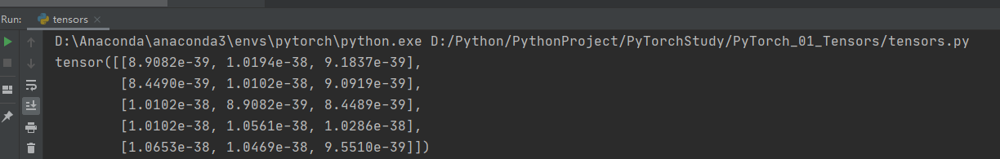

# PyTorch学习笔记

> 参考教程：
>
> - https://pytorch.apachecn.org/docs/1.4/blitz/tensor_tutorial.html
> - https://pytorch-cn.readthedocs.io/zh/latest/
> - http://pytorch123.com/
> - 

## PyCharm基础使用

- 首先通过anaconda安装好pytorch的环境

```bash
conda env list
```


- 新建工程


- 输入工程的名字和目录，选择已存在的解释器。（不要创建新的Conda环境)


- 添加Python解释器，选择Conda的环境


- 选择conda中pytorch的环境


- 点击OK


- 选择刚才添加的pytorch的环境


- 再在项目目录下新建一个python文件


- 编写代码，测试

```python
import torch

x = torch.empty(5, 3)
print(x)
```

- 右键，运行当前的文件




- OK，在PyCharm中就可以使用PyTorch的环境来开发了。 

## 使用VS Code进行Python开发

- 在VS Code中安装Pylance、Python、Python这两个插件


- 使用VS Code打开刚才新建的项目，点击页面的左下角，选择pytorch的解释器


- 按Ctrl + F5运行程序


- OK，VS Code也可以使用pytorch的环境了

## PyTorch入门

### 张量

> 参考链接：https://www.jianshu.com/p/5ae644748f21/
>
> 张量：张量就是按照任意维排列的一堆数字的推广。其实标量，向量，矩阵它们三个也是张量，标量是零维的张量，向量是一维的张量，矩阵是二维的张量。除此之外，张量还可以是四维的、五维的、。。。等等

> 超过100种tensor的运算操作，包括转置，索引，切片，数学运算， 线性代数，随机数等，具体访问:
>
> https://pytorch.org/docs/stable/torch.html

#### 张量的初始化

```python
# 创建一个没有初始化的张量（5*3的矩阵）
x = torch.empty(5, 3)
print(x)

# 创建一个随机初始化（符合均匀分布的初始化）的张量
x = torch.rand(5, 3)
print(x)

# 初始化一个全为0的张量，并指定数据类型
x = torch.zeros(5, 3, dtype=torch.long)
print(x)

# 通过列表创建一个张量（是一个1维的）
x = torch.tensor([5.20, 10.24])
print(x)

# 创建一个三维的张量
x = torch.Tensor(2, 3, 4)
print(x)
```

输出：

```python
tensor([[1.0653e-38, 1.0469e-38, 9.5510e-39],
        [9.9184e-39, 9.0000e-39, 1.0745e-38],
        [9.9184e-39, 9.6429e-39, 8.4490e-39],
        [9.2755e-39, 1.0286e-38, 1.0102e-38],
        [9.2755e-39, 1.0286e-38, 1.6956e-43]])
tensor([[0.4875, 0.1226, 0.8948],
        [0.6380, 0.8978, 0.0636],
        [0.7963, 0.1985, 0.1099],
        [0.1694, 0.3896, 0.2517],
        [0.4268, 0.1116, 0.1144]])
tensor([[0, 0, 0],
        [0, 0, 0],
        [0, 0, 0],
        [0, 0, 0],
        [0, 0, 0]])
tensor([ 5.2000, 10.2400])
tensor([[[1.0653e-38, 1.0469e-38, 9.5510e-39, 9.9184e-39],
         [9.0000e-39, 1.0561e-38, 1.0653e-38, 4.1327e-39],
         [8.9082e-39, 9.8265e-39, 9.4592e-39, 1.0561e-38]],

        [[1.0653e-38, 1.0469e-38, 9.5510e-39, 1.0378e-38],
         [8.9082e-39, 1.0653e-38, 1.1204e-38, 1.0653e-38],
         [1.0194e-38, 8.4490e-39, 1.1020e-38, 0.0000e+00]]])
```

#### 查看张量的形状

```python
# 查看张量的形状
print(x.size()) # torch.Size([2, 3, 4])
```

#### 张量的运算

- 加法

```python
x = torch.rand(5, 3)
y = torch.rand(5, 3)
print(x)
print(y)
# 同维度可以直接加法运算
print(x + y)
print(torch.add(x, y))
# 给定一个输出张量作为参数
result = torch.empty(5, 3)
torch.add(x, y, out=result)
print(result)
# 原位/原地操作(in-place）
y.add_(x)
print(y)
```

输出：

```python
tensor([[0.4904, 0.9126, 0.1459],
        [0.3817, 0.2978, 0.0638],
        [0.3696, 0.3003, 0.6061],
        [0.5920, 0.2474, 0.4804],
        [0.2580, 0.6475, 0.5598]])
tensor([[0.6343, 0.2881, 0.8652],
        [0.8035, 0.2261, 0.9240],
        [0.8178, 0.3477, 0.7340],
        [0.3546, 0.6354, 0.6672],
        [0.8642, 0.5874, 0.5521]])
tensor([[1.1247, 1.2007, 1.0111],
        [1.1852, 0.5239, 0.9878],
        [1.1873, 0.6481, 1.3400],
        [0.9466, 0.8828, 1.1476],
        [1.1222, 1.2349, 1.1118]])
tensor([[1.1247, 1.2007, 1.0111],
        [1.1852, 0.5239, 0.9878],
        [1.1873, 0.6481, 1.3400],
        [0.9466, 0.8828, 1.1476],
        [1.1222, 1.2349, 1.1118]])
tensor([[1.1247, 1.2007, 1.0111],
        [1.1852, 0.5239, 0.9878],
        [1.1873, 0.6481, 1.3400],
        [0.9466, 0.8828, 1.1476],
        [1.1222, 1.2349, 1.1118]])
tensor([[1.1247, 1.2007, 1.0111],
        [1.1852, 0.5239, 0.9878],
        [1.1873, 0.6481, 1.3400],
        [0.9466, 0.8828, 1.1476],
        [1.1222, 1.2349, 1.1118]])
```

#### 改变张量的形状

```python
x = torch.randn(4, 4)
y = x.view(16)
z = x.view(-1, 2)
print(x, x.size(), y, y.size(), z, z.size())
```

```python
tensor([[ 0.2250,  0.9563, -2.0148,  0.0322],
        [-2.0283,  0.1147, -0.4802, -0.1632],
        [-1.0281, -1.3552, -0.3760, -1.5955],
        [-0.3073,  0.3507, -0.7678, -0.1268]]) torch.Size([4, 4]) tensor([ 0.2250,  0.9563, -2.0148,  0.0322, -2.0283,  0.1147, -0.4802, -0.1632,
        -1.0281, -1.3552, -0.3760, -1.5955, -0.3073,  0.3507, -0.7678, -0.1268]) torch.Size([16]) tensor([[ 0.2250,  0.9563],
        [-2.0148,  0.0322],
        [-2.0283,  0.1147],
        [-0.4802, -0.1632],
        [-1.0281, -1.3552],
        [-0.3760, -1.5955],
        [-0.3073,  0.3507],
        [-0.7678, -0.1268]]) torch.Size([8, 2])
```

#### Torch张量转为numpy数组

> Torch张量和NumPy数组将共享它们的底层内存位置，因此当一个改变时,另外也会改变。

```python
a = torch.ones(5)
print(a)

b = a.numpy()
print(b)

a.add_(1)
print(a)
print(b)
```

输出：

```python
tensor([1., 1., 1., 1., 1.])
[1. 1. 1. 1. 1.]
tensor([2., 2., 2., 2., 2.])
[2. 2. 2. 2. 2.]
```

#### numpy数组转为Torch张量

```python
import numpy as np

a = np.ones(5)
print(a)
b = torch.from_numpy(a)
print(b)
np.add(a, 1, out=a)
print(a)
print(b)
```

输出：

```python
[1. 1. 1. 1. 1.]
tensor([1., 1., 1., 1., 1.], dtype=torch.float64)
[2. 2. 2. 2. 2.]
tensor([2., 2., 2., 2., 2.], dtype=torch.float64)
```

#### CUDA上的张量

```python
# 当GPU可用时,我们可以运行以下代码
# 我们将使用`torch.device`来将tensor移入和移出GPU
if torch.cuda.is_available():
    device = torch.device("cuda")          # a CUDA device object
    y = torch.ones_like(x, device=device)  # 直接在GPU上创建tensor
    x = x.to(device)                       # 或者使用`.to("cuda")`方法
    z = x + y
    print(z)
    print(z.to("cpu", torch.double))       # `.to`也能在移动时改变dtype
```

输出：

```python
tensor([0.2253], device='cuda:0')
tensor([0.2253], dtype=torch.float64)
```

